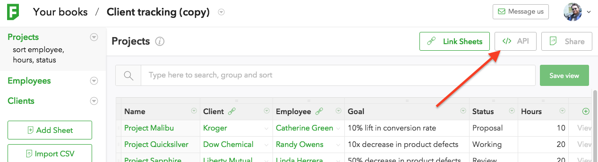
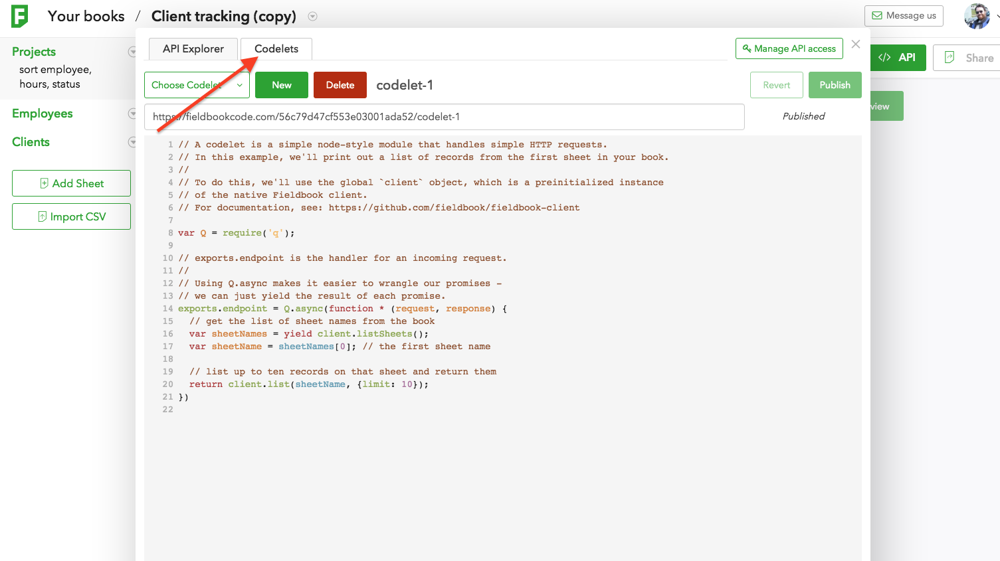

Fieldbook Codelets
==================

Getting Started
---------------

Fieldbook codelets are the simpliest way to host Node code from a public URL.  Codelets provide easy access to your Fieldbook data through a preinitialized [fieldbook-client](https://github.com/fieldbook/fieldbook-client) object.

To access codelets on your book, open the API modal.



Then open the codelets tab



From this pane, you can edit the code for your custom endpoint.  Using curl or a browser, you can fire a request against the given url to run the codelet.

A codelet should take no more than a few seconds to run.  Longer codelets may be terminated in the middle of their execution.  Timeout happens around 50 seconds.

The code should expose an exports.endpoint function that takes a request and a response.  That function may return a promise (Q and Bluebird are provided), may call response.send
r may take a third parameter which is a done callback.  It may also just return JSON objects or strings to return to the caller.

### Response Examples

**Bare Object Response**
```javascript
exports.endpoint = function (req) {
  return {hello: 1};
}
```

**Promise response**
```javascript
var Q = require(‘q’);
exports.endpoint = function (req) {
  return Q.delay(10).then(function () {
    return {hello: 1};
  })
}
```

**Done Callback**
```javascript
exports.endpoint = function (req, res, done) {
  setTimeout(function () {
    done(null, {hello: 1})
  }, 500);
}
```

The done callback expects arguments of ERR and RESULT.  Pass null for error if
there is none.

**Using the Response Object**
```javascript
exports.endpoint = function (res, req) {
  req.type(‘text/plain’);
  req.send(‘Hello World’);
}
```

Modules
-------

There is currently a hand managed list of allowed npm requires.  Here is the current list:

* amazon-product-api (0.3.8)
* async (1.5.2)
* aws-sdk (2.2.33)
* bcrypt (0.8.5)
* bitly (4.1.1)
* bluebird (3.2.1)
* body-parser (1.15.0)
* bunyan (1.6.0)
* chalk (1.1.1)
* cheerio (0.20.0)
* clone (1.0.2)
* co (4.6.0)
* colors (1.1.2)
* connect (3.4.1)
* cors (2.7.1)
* cradle (0.7.1)
* dropbox (0.10.3)
* ebay-api (1.12.0)
* elasticsearch (10.1.3)
* fb (1.0.2)
* fieldbook-client (1.0.4)
* firebase (2.4.0)
* flickrapi (0.3.36)
* formidable (1.0.17)
* github (0.2.4)
* glob (7.0.0)
* googleapis (2.1.7)
* handlebars (4.0.5)
* heroku (0.1.3)
* hoek (3.0.4)
* instagram-node (0.5.8)
* intrusive (1.0.1)
* irc (0.4.1)
* joi (8.0.1)
* jsdom (8.0.2)
* jshint (2.9.1)
* json-socket (0.1.2)
* jsonwebtoken (5.5.4)
* koa (1.1.2)
* lazy (1.0.11)
* lodash (4.1.0)
* lodash.assign (4.0.2)
* lru-cache (4.0.0)
* mandrill-api (1.0.45)
* marked (0.3.5)
* merge (1.2.0)
* mime (1.3.4)
* moment (2.11.1)
* mongodb (2.1.7)
* mongoose (4.4.3)
* natural (0.2.1)
* node-fieldbook (1.0.7)
* node-foursquare (0.3.0)
* node-linkedin (0.5.3)
* node-uuid (1.4.7)
* node-wikipedia (0.0.2)
* node-xmpp-client (3.0.0)
* nodemailer (2.1.0)
* numeric (1.2.6)
* once (1.3.3)
* papaparse (4.1.2)
* passport (0.3.2)
* pg (4.4.5)
* pinterest-api (1.1.4)
* q (1.4.1)
* ramda (0.19.1)
* redis (2.4.2)
* redux (3.3.1)
* request (2.69.0)
* requestify (0.1.17)
* restify (4.0.4)
* science (1.9.3)
* sequelize (3.19.2)
* shortid (2.2.4)
* slack (5.2.2)
* split (1.0.0)
* spotify-web-api-node (2.2.0)
* stream-buffers (3.0.0)
* stripe (4.3.0)
* superagent (1.7.2)
* syntax-error (1.1.5)
* through (2.3.8)
* through2 (2.0.1)
* traverse (0.6.6)
* tumblr (0.4.1)
* twilio (2.9.0)
* twitter (1.2.5)
* underscore (1.8.3)
* underscore.string (3.2.3)
* us-census-api (0.0.5)
* validator (4.8.0)
* vimeo (1.1.4)
* winston (2.1.1)
* wordpress (1.1.2)
* wundergroundnode (0.9.0)
* xlsx (0.8.0)
* xml2js (0.4.16)
* yahoo-finance (0.2.12)
* yargs (4.1.0)
* yelp (1.0.1)

Is your favorite module missing? We can't guarantee anything, but send us a contact through the message us button in the app.

Using the Fieldbook Client
--------------------------

We provide a preinitialized client with access to the book the codelet is one on the `client` global object. This is from the (fieldbook-client)[https://github.com/fieldbook/fieldbook-client] node module.  Here is an example using this client ot return all names from the 'People' of a book:

```javascript
exports.endpoint = function (request) {
  return client.list(‘people’).then(function (records) {
    return records.map(function (record) {
      return record.name;
    }
  };
}
```

ES6
---

Codelets are run on node 5.5.0 with the --harmony flag.  This means you can use a number of great ES6 features, like fat arrow syntax and generators.  Here is an example returning all of the names from the 'People' sheet

```javascript
var Q = require(‘q’);
exports.endpoint = Q.async(function * (request) {
  var people = yield client.list(‘people’);
  return people.map(p => p.name);
})
```

Requesting Codelets
-------------------

Your codelet URL will respond to any of these HTTP methods: GET, POST, PUT,
PATCH or DELETE.  The request object passed to the function will have headers,
params, body, query, and method keys.  The headers key has all of the HTTP
headers received from the client.  The body, and query keys represent various
parameters, either in the body or as query params to the URL.  The params key
is a simple combination of body and query, with query taking precedence.

Requests will accept JSON body parameters if the Content-Type of the request is
`application/json`, and similarly will accept form parameters of the
Content-Type is `application/x-www-form-urlencoded`.

Its easy to inpect what is available on the reqeust object, just return it from
a codelet like so:

```javascript
exports.endpoint = function (request) {
  return request;
}
```

And then request it with some paramters:

`curl CODELET_URL\?foo\=bar -d '{"zip": "hello"}' -H 'Content-Type: application/json'`

**Example response**

```
{
  "headers": {
    "host": "fieldbook.com",
    "connection": "close",
    "user-agent": "curl/7.43.0",
    "accept": "*/*",
    "content-type": "application/json",
    "x-request-id": "92cf3346-f407-4d2e-a1be-35f83af9d532",
    "x-forwarded-for": "XXX.XXX.XXX.XXX",
    "x-forwarded-proto": "https",
    "x-forwarded-port": "443",
    "via": "1.1 vegur",
    "connect-time": "0",
    "x-request-start": "1455144616294",
    "total-route-time": "0",
    "content-length": "16"
  },
  "body": {
    "zip": "hello"
  },
  "params": {
    "zip": "hello",
    "foo": "bar"
  },
  "query": {
    "foo": "bar"
  },
  "method": "POST"
}
```

Response Object
---------------

The second parameter passed to your function is the response object, it has
several convenience methods, but boils down to setting headers and sending some
kind of response.

If you ever call write or send on the response object, you may still return a
promise from your endpoint, but the result of the promise will be ignored.  If
you call write and also use the done callback to return a result, an error will
be thrown.

### Response Methods

#### send(STRING or OBJECT)

When called with no arguments, will send the prepared body (by the write()
method).

Send a response.  If no Content-Type header is set and a string is passed, type
will be set to `text/plain`, and the passed string will be the response body.
If an object is passed, `application/json` will be the response Content-Type
and the object will be stringified to JSON.

If a Content-Type is already set, the string will be used verbatim as the body
of the response, if passed an object, object.toString() will be used.

Calling this method ends the request and further calls to this or any other
response method will result in an error.

#### write(STRING)

Call to incrementally append data to the body of the response.

#### status(CODE)

Sets the HTTP status code of the response.

#### setHeader(NAME, VALUE)

Set a header value.  You may not set cookies, and trying to will result in an
error when your code is run.

#### type(CONTENT_TYPE)

Convenience method for setting the Content-Type header.

#### location(URL)

Convenience method for setting the Location header.

#### redirect(CODE, URL) or redirect(URL)

Shorthand for setting the status code and URL for a redirect.  CODE defaults to 302 if not passed.

Convenience method for setting the Location header.
