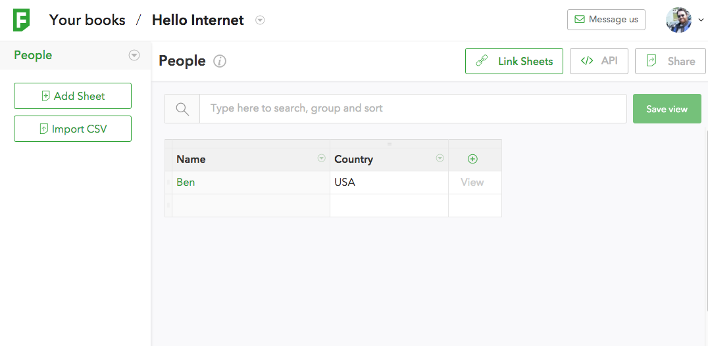

Easy-peasy record creation via Codelets
=======================================

This [Codelet](../codelets.md) example will show you how to create a super
simple HTML form to create new rows in your Fieldbook database.

We're going to start with a super simple sheet that just tracks people who have
seen this example.  Check out [this
book](https://fieldbook.com/books/56cccbd72ba55103004f278d).  Very simple
sheet, just with Name and Country.  Feel free to copy that sheet and play with
it yourself!

Here is a screenshot:



We are going to create a small codelet that when retrieved renders an HTML form
and on POST creates a record

Code
----

First lets create the endpoint function that will dispatch based on the HTTP
method (is this request getting the form to display or is it submitting data)

```javascript
exports.endpoint = function (req, res) {
  if (req.method === 'GET') {
    return renderForm(req, res);
  } else if (req.method === 'POST') {
    return postForm(req, res);
  } else {
    throw new Error('Bad method: ' + req.method);
  }
}
```

Then we need to render the form, which just consists of setting the
Content-Type (see the
[codelets response documentation](../codelets.md#response-object)) for more
info.)

```javascript
var renderForm = function (req, res) {
  res.type('text/html')
  return `
<head><link rel="stylesheet" href="//yegor256.github.io/tacit/tacit.min.css"/></head>
<body>
  <form method="post">
    Name: <input name="name" type="text">
    Country: <input name="country" type="text">
    <input type="submit">
  </form>
</body>
`
}
```

Note, here we are using the cool little [Tacit CSS](//yegor256.github.io/tacit/)
library, and also we are using ES6's [template strings](//developer.mozilla.org/en-US/docs/Web/JavaScript/Reference/Template_literals)

And finally, we need to create the record from the resulting post

```javascript
var Q = require('q');
var postForm = Q.async(function * (req, res) {
  yield client.create('people', req.params);
  return 'Thanks!'
})
```

The client object is a preinitialized javascript object for talking to
Fieldbook's REST api.  It is an instance of a
[fieldbook-client](//github.com/fieldbook/fieldbook-client) object.  We are
also using
[generators](//developer.mozilla.org/en-US/docs/Web/JavaScript/Reference/Statements/function*)
from ES6 as well as Q's
[async](//github.com/kriskowal/q/wiki/API-Reference#qasyncgeneratorfunction)
tool for creating promised functions from generators

And that is it.  3 simple functions and you can easy have a form submitting
data to your Fieldbook

Extensions
----------

Obivously, there are a lot of additions that could be added to this tiny
codelet.  For instance, we don't do any validation of country, maybe we should
force the form to validate the Country name out of a list.  We could also
consult external services using `requestify`.  If we had multiple linked sheets
we could use the data from the POST to setup records in multiple sheets and
link them together.

All The Code
------------

Here is all the code in one place suitable for pasting into your own book.

```javascript
var Q = require('q');
exports.endpoint = function (req, res) {
  if (req.method === 'GET') {
    return renderForm(req, res);
  } else if (req.method === 'POST') {
    return postForm(req, res);
  } else {
    throw new Error('Bad method: ' + req.method);
  }
}

var renderForm = function (req, res) {
  res.type('text/html')
  return `
<head><link rel="stylesheet" href="//yegor256.github.io/tacit/tacit.min.css"/></head>
<body>
  <form method="post">
    Name: <input name="name" type="text">
    Country: <input name="country" type="text">
    <input type="submit">
  </form>
</body>
`
}

var postForm = Q.async(function * (req, res) {
  yield client.create('people', req.params);
  return 'Thanks!'
})
```
