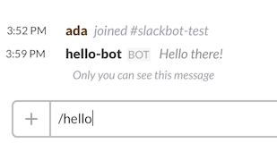
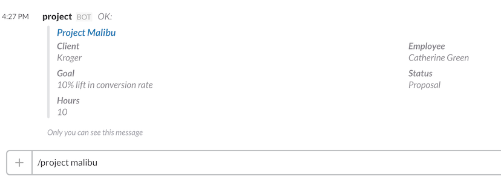

# Creating a Slack bot in 2 minutes using Fieldbook

Start your timer now.

Create a new book, or go to a book you already have where you are an owner or admin. Click the "API" button. Click the "Codelets" tab. Click "New".

Click the editor, select all, and type:

```js
exports.endpoint = request => "Hello there!";
```

Click the URL field and copy the URL. Now click "Publish".

Go to https://slack.com/apps/build/custom-integration

Click "Slash Commands". Type "/hello" under "Choose a Command" and hit enter.

Paste the URL you copied in the URL field. Hit enter.

And time!

## No seriously, you just made a Slack bot

Go into Slack, type "/hello" and your bot will respond "Hello there!".



Admittedly, this isn't a very helpful bot. So let's backtrack a bit.

# Creating a *useful* Slack bot in ~~2~~ 10 minutes using Fieldbook

So let's go back to our codelet in Fieldbook, and take a look at —

*Wait a sec, what's a "codelet"?*

A codelet is a snippet of code that can talk to your book, and respond to HTTP
requests from the outside world. More precisely, it's a tiny webserver that
handles a single URL endpoint with the minimum boilerplate possible.  See the
[Getting Started](../codelets.md) page for more info

The entrypoint into a codelet is given by `exports.endpoint`, So when you
create a codelet with the oneliner:

```js
exports.endpoint = request => "Hello there!";
```

you are effectively creating a webserver that will return the string "Hello
there!" whenever someone hits its URL.

## Let's do something less trivial

Before we dig in, I recommend you copy [this
book](https://fieldbook.com/books/56cb4d987753cf030003e54c) as a starting
point. The finished codelet is already on that book, but you can just create a
new one if you want to follow along. Of course, you'll also want to go back and
create a new slash command for the new codelet's URL (or just change the old
slash command). I'll assume you made your slash command `/project-codelet`

First of all, let's ditch the arrow-function syntax, and make a little skeleton
we can add to:

```js
var _ = require('underscore');
var s = require('underscore.string');

exports.endpoint = function (request, response) {
  return 'OK';
}
```

We're requiring those modules because we'll use them later. We've included a
[big list](../codelets.md#modules) of popular npm modules for you to use (we're
always open to adding more — just give us a shout).

Let's start out by looking at the text parameter Slack gives us. This
represents what the user types after `/project-codelet`.

```js
...
exports.endpoint = function (request, response) {
  var text = request.body.text;
  return s.reverse(text);
}
```

Publish, and try it out. Your bot should print out "oof".

## That was still pretty trivial

This is all well and good, but we're still not doing anything with our data.
One of the great things about codelets is that they provide an API client for
you with zero setup. You access it with the global `client`.

Let's make our bot tell us whether or not a given project exists:

```js
...
exports.endpoint = exports.endpoint = function (request, response) {
  var projectName = request.body.text;
  // Get the long form name of the project
  var fullName = `Project ${s.capitalize(projectName)}`;

  // Find all records with the given name
  var query = {name: fullName};
  return client.list('projects', query).then(function (records) {
    // We just want the first record
    var record = records[0];

    if (!record) return `No project found named ${projectName}`; // Did not match any record

    return `Found a project named ${projectName}!`
  })
}
```

This simply looks in the "Projects" sheet for records named "Project
\<whatever\>", and tells us whether it found anything. Now we're returning a
promise, which the codelet will automatically handle for us.

Now if we try `/foo sapphire`, we'll see "Found a project named sapphire". If
we try `/foo corndog`, we'll see "No project found named corndog".

## Outputting more info

Of course, the Fieldbook client tells us a lot more than whether the record
exists. Let's have our bot print out the record's fields:

```js
    ...
    if (!record) return `No project found named ${projectName}`; // Did not match any record

    var client = record.client[0]; // Client is a link field, so it's going to give us an array
    var clientName = client ? client.name : '<none>'; // May not have a client

    var employee = record.employee[0] // Same deal as for clients
    var employeeName = employee ? employee.name : '<none>';

    var attributes = [
      {title: 'Client',   value: clientName,    short: true},
      {title: 'Employee', value: employeeName,  short: true},
      {title: 'Goal',     value: record.goal,   short: true},
      {title: 'Status',   value: record.status, short: true},
      {title: 'Hours',    value: record.hours,  short: true},
    ];

    return {
      text: "OK:",
      attachments: [{
        fallback: record.name,
        title: record.name,
        title_link: record.record_url,
        fields: attributes,
      }]
    }
    ...
```

Now we're doing a more sophisticated response. We return an object with an
attachment to display a consise summary of the record.



Since we returned an object, the codelet will automatically switch the response
type to `application/json` and stringify the object.

# Just the beginning

That should get you started with a basic Slack bot that can talk to your book.
Of course, there's no reason to limit yourself to just looking up individual
records. You can query, edit, and create new records too.

Be sure to check out the [API
documentation](https://github.com/fieldbook/api-docs), and the [docs for the
fieldbook-client module](https://github.com/fieldbook/fieldbook-client) to see
what all you can do.
