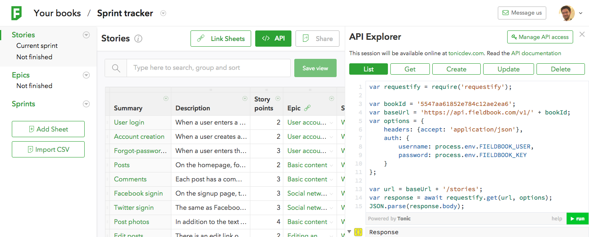

Fieldbook API Quick Start
=========================

Explore
-------

The Fieldbook API explorer is the the fastest way to get started experimenting and playing with the API. Just hit the API button on any book:

Need an example book? Use [this one](https://fieldbook.com/books/5643bb3dfd9d07030072b888) (make a copy for yourself first).

The console shows you example requests in JavaScript and lets you run them and view the responses. Edit the code as much as you like to prototype and explore. The console is powered by [Tonic](https://tonicdev.com), so you can `require()` any npm module, and use ES7-style `await` to resolve promises inline.

From prototype to production
----------------------------

The API explorer uses a temporary session-based API key. When you're ready to turn your prototyping into a script or production code:

1. Create a (non-temporary) API key using the “Manage API access” button in the API console.

2. Copy down the password (API secret); it will only be shown once.

3. Now you can use the API key (username) and secret (password) to write client code.

Code you write in the console can be run directly as a Node script. Be sure to `npm install requestify` and any other modules you use, and set the `FIELDBOOK_USER` and `FIELDBOOK_KEY` environment variables to your API key and secret.

See the [client examples](client-examples.md) and the full [API reference](reference.md).
