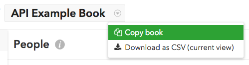
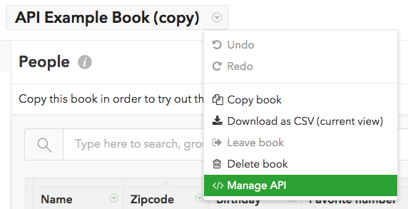
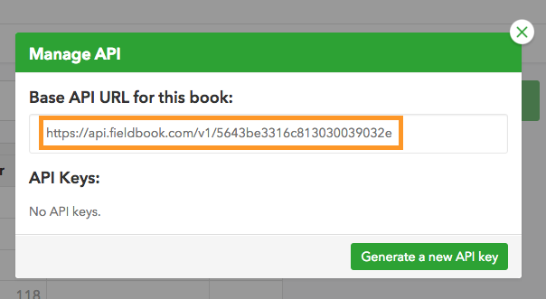
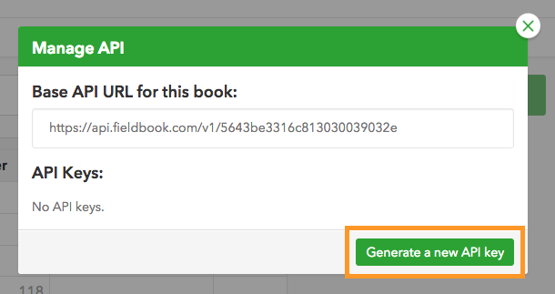
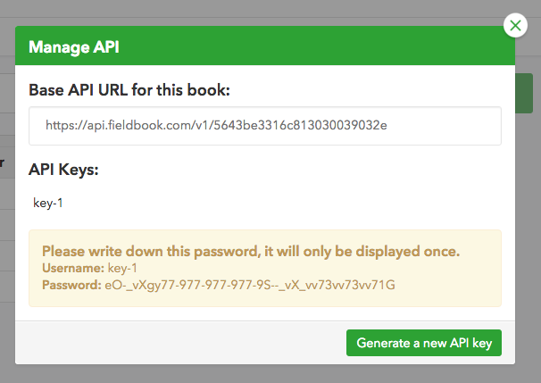

Fieldbook API Quick Start
=========================

1. Just a warning up front: This is a very early beta! See the [reference](reference.md) for a list of limitations.

2. Go to this example book: https://fieldbook.com/books/5643bb3dfd9d07030072b888

3. Make a copy of the book:
    

4. Open the API menu:
    

5. Note the base URL:
    

6. Create an API key:
    

7. Write down the API key and secret (username/password for basic auth):
    

8. Test the API using `curl`, your API key and secret, and your base URL, like this:
    ```
    $ curl -u key-1:eO-_vXgy77-977-977-977-9S--_vX_vv73vv73vv71G https://api.fieldbook.com/v1/5643be3316c813030039032e/people
    ```
    The outcome should be JSON like this:
    ```
    [
      {
        "id": 1,
        "name": "Alice",
        "zipcode": "90210",
        "birthday": "1985-03-02",
        "favorite_number": 12,
        "items": [
          {
            "id": 1,
            "name": "Alpha"
          }
        ]
      },
      {
        "id": 2,
        "name": "Bob",
        "zipcode": "15213",
        "birthday": "1979-06-04",
        "favorite_number": 7,
        "items": [
          {
            "id": 2,
            "name": "Bravo"
          },
          {
            "id": 3,
            "name": "Charlie"
          }
        ]
      },
      {
        "id": 3,
        "name": "Carol",
        "zipcode": "08450",
        "birthday": "1964-09-30",
        "favorite_number": 99,
        "items": []
      }
    ]
    ```

9. Read the [reference](reference.md) for more details.
